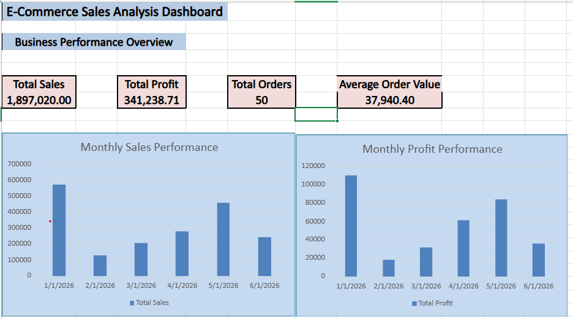
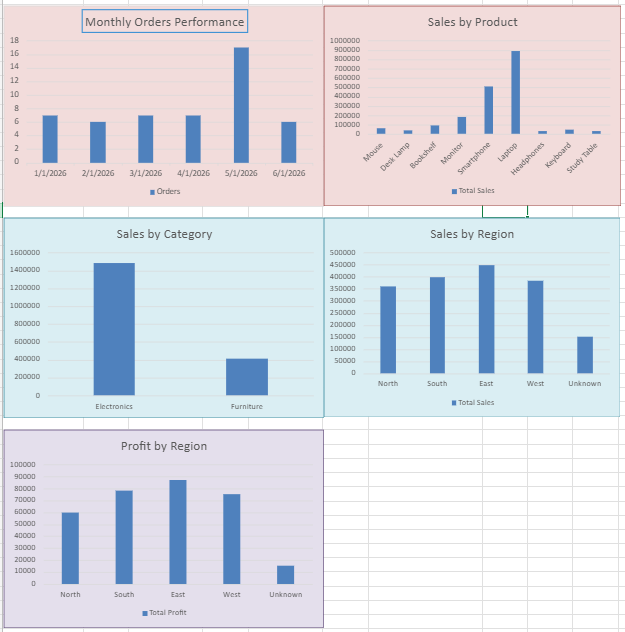
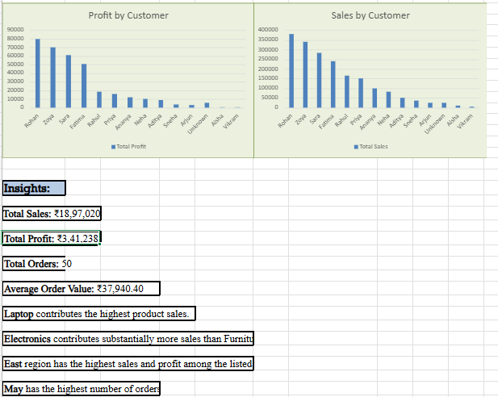

# E-Commerce Sales Analysis Dashboard

An interactive E-Commerce Sales Analysis Dashboard built using Microsoft Excel to analyze sales, profit, orders, products, customers, categories, and regional performance.

## 📌 Project Overview

This project analyzes e-commerce sales data and converts raw transactional data into meaningful business insights using Microsoft Excel.

The dashboard provides a consolidated view of key business performance metrics and helps identify sales and profit trends.

## 🎯 Objectives

- Analyze overall sales and profit performance
- Identify top-performing products and customers
- Analyze sales and profit by region
- Compare category-wise sales
- Track monthly sales, profit, and order trends
- Present insights through an interactive Excel dashboard

## 🛠️ Tools & Technologies

- Microsoft Excel
- Excel Formulas
- Data Cleaning
- Data Analysis
- Pivot Tables
- Charts & Data Visualization
- Dashboard Design

## 📊 Dataset

The dataset contains e-commerce transaction information including:

- Order details
- Product
- Category
- Sales
- Profit
- Quantity
- Customer
- Region
- Order Date

## 🔄 Analysis Process

Raw Data  
↓  
Data Cleaning  
↓  
Data Preparation  
↓  
Analysis & Calculations  
↓  
Charts & Visualizations  
↓  
Dashboard  
↓  
Business Insights

## 📈 Dashboard Features

### KPI Metrics
- Total Sales: ₹1,897,020
- Total Profit: ₹341,238.71
- Total Orders: 50
- Average Order Value: ₹37,940.40

### Visualizations
- Monthly Sales Performance
- Monthly Profit Performance
- Monthly Orders Performance
- Sales by Product
- Sales by Category
- Sales by Region
- Profit by Region
- Sales by Customer
- Profit by Customer

## 💡 Key Insights

- Laptop contributes the highest product sales.
- Electronics contributes substantially more sales than Furniture.
- East region records the highest sales and profit among the listed regions.
- May has the highest number of orders.
- The dashboard provides a consolidated view of sales and profitability across different business dimensions.

## 🖼️ Dashboard Preview

### Dashboard Overview

### Sales Analysis

### Business Insights

## 📂 Repository Contents

| File | Description |
|------|-------------|
| `ECommerce_Sales_Analysis.xlsx` | Complete Excel analysis workbook and dashboard |
| `Dashboard_Overview.png` | Dashboard overview screenshot |
| `Sales_Analysis.png` | Sales analysis screenshot |
| `Business_Insights.png` | Business insights screenshot |

## 👩‍💻 Author

**Tuba Tasneem**

Bachelor of Engineering – Artificial Intelligence & Machine Learning

Interested in Data Analytics, Machine Learning and Data-driven solutions.
